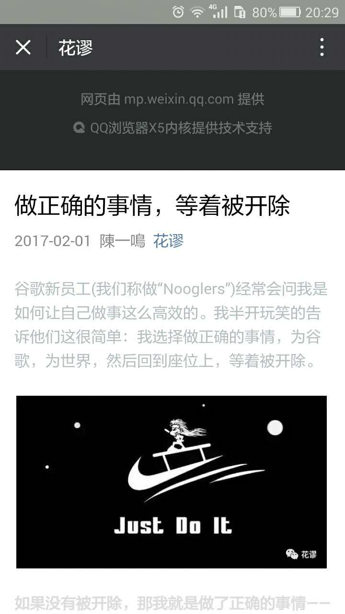

# 分享

这些内容我昨天中午已经跟郝时和任伟侃过，我有考虑到底要不要说这个，比较鸿观也比较难的东西，原本是准备给大家讲一下一款叫markdownd类别的工具的，但是昨天中午华总有说一句：“大处着眼，才能超越”。（这句话谁说的："大处着眼，才能超越！"）。我主要讲两个东西一个是：“小程序”，另外一个是：“你五年内错过的成为百万富翁的机会，当然这个命题对在座某些人不成立！”

## 小程序

* 你现在使用最多的PC软件是什么？
  * 为了向大家证明这点我的PPT也是用浏览器做的

* 你现在使用最多的手机端软件是什么？

我不知道大家使用微信的时候有没有注意观察：

其实微信也是一款浏览器，小程序就是跑在微信上的网页，只不过因为新技术做了大量的封装。

* 乔布斯说web才是未来
* 小程序的原理和服务端的架构

## 区块链

* 比特币
  * 挖坟神贴
* 《货币的非国家化》
* 区块链的彼此授权
* ​

## 结束

其实说了这么多

